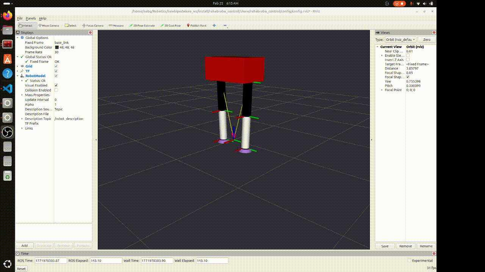
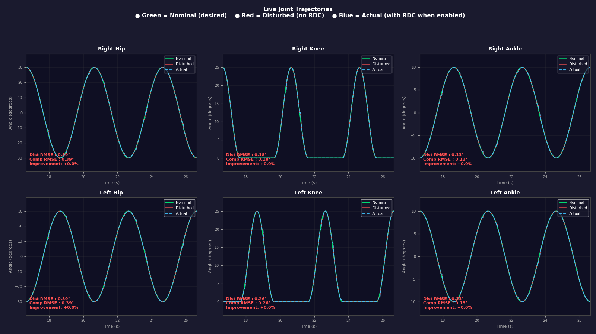
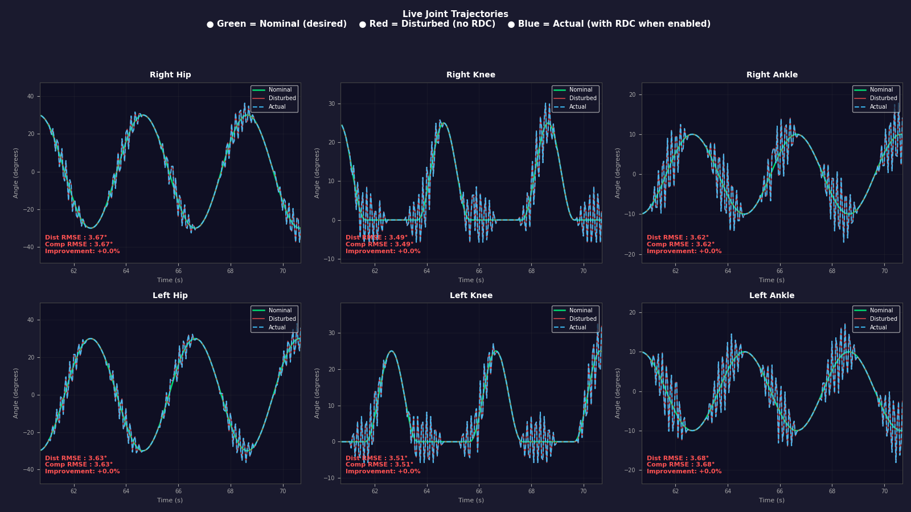
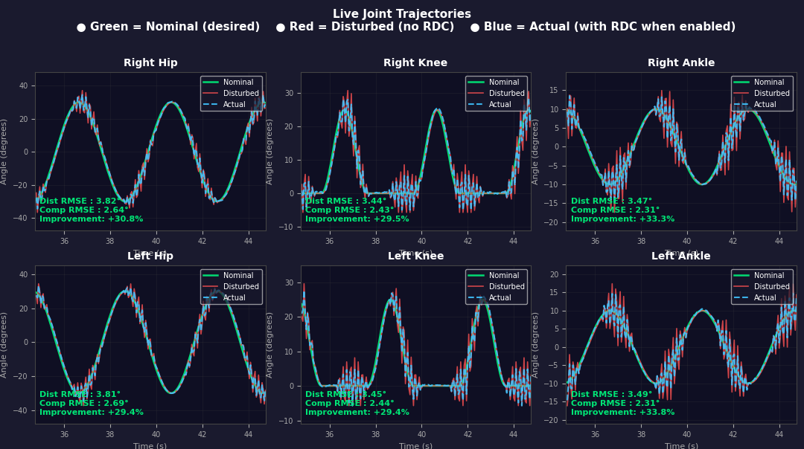

# Residual Dynamics Compensator (RDC) for Bipedal Rehabilitation Robot in ROS2 Jazzy

A ROS2-based real-time disturbance compensation system for a 6-DOF bipedal rehabilitation robot. All motion is simulated: the robot model is visualized in RViz and controlled via `ros2_control` with mock hardware components. No physical robot is required.

The system learns to predict and cancel virtual involuntary patient disturbances (spasticity, muscle bias, fatigue) using an LSTM neural network, publishing corrective joint commands at 20 Hz alongside the nominal gait trajectory.

To only get the Sinusoidal Feedforward Gait Generator, kindly visit: https://github.com/NajeebAhmedBhuiyan/Bipedal-Rehab-Robot

> **Status:** Work in progress. Live deployment achieves ~28% RMSE reduction during active disturbance periods.

---

## What It Does

A sinusoidal walking trajectory is published to the simulated exoskeleton. A disturbance injector adds synthetic patient disturbances on top of the nominal trajectory. The Residual Dynamics Compensator (RDC) observes the resulting joint tracking error and predicts a corrective compensation signal to push the joints back toward the desired trajectory.

Three disturbance types are supported:
- **Spasticity** — random short-duration bursts of high joint error
- **Bias** — slow sinusoidal drift in joint position
- **Fatigue** — progressively increasing disturbance magnitude over time

---

## So Far

- Sinusoidal gait generator and RViz visualization pipeline set up
- Three synthetic disturbance models implemented
- Training data collected across 9 sessions (3 disturbance types × 3 magnitudes)
- LSTM trained and benchmarked against a GPR baseline (13% better offline)
- Full ROS2 deployment pipeline with live plotter showing real-time RMSE and improvement %
- Live evaluation: **28.25% RMSE reduction** across all 6 joints during active disturbance

---

## Figures

### Robot Model in RViz

<!-- Add your RViz snapshot here -->


### Stage 1 — Clean Baseline (disturbance off, RDC off)

<!-- Add your Stage 1 live plotter screenshot here -->


### Stage 2 — Disturbance Active, RDC Off

<!-- Add your Stage 2 live plotter screenshot here -->


### Stage 3 — Disturbance Active, RDC On (only ~28% RMSE Reduction for now!)

<!-- Add your Stage 3 live plotter screenshot here -->


---

## Requirements

- Ubuntu 24.04 LTS
- ROS2 Jazzy
- Python 3.10+
- Conda (for the ML environment)

### ROS2 system Python packages
```
numpy
```

### Conda ML environment

Create a separate Conda environment (e.g. `rdenv`) and install:

```
pytorch
scikit-learn==1.6.1
matplotlib
numpy
```

> **Important — shebang paths:** `residual_dynamics_compensator.py` and `live_plotter.py` use a hardcoded shebang pointing to the Conda environment interpreter. After creating your environment, update the first line of both scripts to match your system path, for example:
> ```
> #!/home/<youruser>/miniconda3/envs/rdenv/bin/python3
> ```

---

## Setup

```bash
# Clone the repository
git clone https://github.com/NajeebAhmedBhuiyan/bipedal-rehab-rdc.git
cd newbipedalexo_ws

# Build
source /opt/ros/jazzy/setup.bash
colcon build --packages-select rehabrobo_control
source install/setup.bash
```

---

## Usage

### 1) Collect Training Data

Make sure the base pipeline is running (launch file below) with `rdc_enabled false` and `disturbance_enabled true`. Then for each session run a disturbance injector and the data collector in separate terminals:

```bash
# Example — Spasticity 0.10 rad, 5 minutes
ros2 run rehabrobo_control disturbance_injector.py \
  --ros-args -p disturbance_type:=spasticity \
             -p magnitude:=0.10 \
             -p burst_duration:=1.5 \
             -p burst_interval_min:=0.5 \
             -p burst_interval_max:=1.5

ros2 run rehabrobo_control ml_data_collector.py \
  --ros-args -p session_label:=spasticity_mag010 \
             -p disturbance_type:=spasticity \
             -p magnitude:=0.10
```

Collect 9 sessions total — spasticity at 0.10/0.15/0.20 rad (5 min each), bias at 0.05/0.10/0.15 rad (5 min each), fatigue at 0.15/0.20/0.25 rad (8 min each). CSVs are saved to `~/rehabrobo_logs/ml_data/`.

Verify column count before uploading:
```bash
head -1 ~/rehabrobo_logs/ml_data/<any_session>.csv | tr ',' '\n' | wc -l
# Must print 207
```

### 2) Train the Model

Upload the 9 CSVs to a Google Drive folder (e.g. `ml_data_v3`). Open `notebooks/LSTM_GRP_RDC_V3.ipynb` in Google Colab, update `DATA_DIR` in Cell 2 to point to your Drive folder, and run all cells. After training completes download:

```
rdc_lstm_best.pt
scaler_X.pkl
scaler_y.pkl
```

### 3) Install the Model Files

Create a folder for the model files and place them there:

```bash
mkdir -p ~/rehabrobo_logs/MODELS-n-FIGS
cp ~/Downloads/rdc_lstm_best.pt ~/rehabrobo_logs/MODELS-n-FIGS/
cp ~/Downloads/scaler_X.pkl     ~/rehabrobo_logs/MODELS-n-FIGS/
cp ~/Downloads/scaler_y.pkl     ~/rehabrobo_logs/MODELS-n-FIGS/
```

The model path is set in two places — update both if you use a different directory:

- `rehabrobo_full.launch.py` → `MODELS_DIR` variable at the top of the file
- `residual_dynamics_compensator.py` → default values of `model_path`, `scaler_x_path`, `scaler_y_path` parameters

### 4) Launch the Full Pipeline

```bash
ros2 launch rehabrobo_control rehabrobo_full.launch.py
```

This starts all nodes with staggered delays. The live plotter window opens after ~7 seconds.

Optional launch arguments:
```bash
ros2 launch rehabrobo_control rehabrobo_full.launch.py \
  disturbance_type:=spasticity \
  magnitude:=0.15 \
  session_label:=my_session
```

### 5) Run the 3-Stage Experiment

From a separate terminal, step through the three stages:

```bash
# Stage 1 — Clean baseline
ros2 param set /command_mixer disturbance_enabled false
ros2 param set /command_mixer rdc_enabled false

# Stage 2 — Disturbance on, RDC off
ros2 param set /command_mixer disturbance_enabled true
ros2 param set /command_mixer rdc_enabled false

# Stage 3 — RDC compensating
ros2 param set /command_mixer rdc_enabled true
ros2 param set /command_mixer disturbance_enabled true

```

> **Note:** For the most consistent live plotter readings in Stage 3, enable both `rdc_enabled` and `disturbance_enabled` at the same time rather than switching from Stage 2. For paper-quality results, use the error monitor CSV logs rather than live plotter snapshots.

### 6) Evaluate Results

Error monitor CSVs are saved to `~/rehabrobo_logs/` and contain per-timestep disturbed RMSE, compensated RMSE, and improvement % for every joint. Use these for quantitative evaluation rather than the live plotter, which shows a short rolling window.
